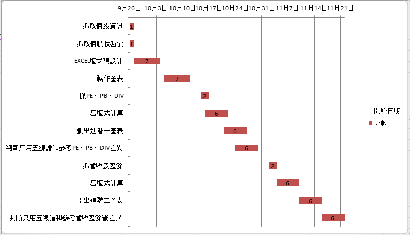
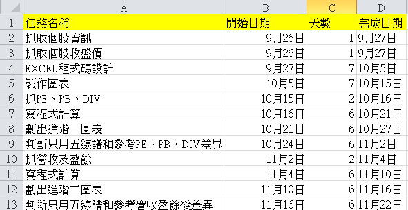

# 3B_13

# 專題題目：股票分析專案軟體

### 指導教授：薛兆亨
### 組員：盧泓元、朱偉正、徐子洹、潘言禎

#### 內容：用10年資料等基本面資料協助判斷使用的指標，除了本益比(PE)，還有股價淨值比(PB)，股息殖利率(DY)，並用樂活五線譜判斷走勢，搭配本益比、淨值比、殖利率等基本面的使用，可進一步確認目前股價的位置是貴還是便宜。

#### 效益 : 三考此五線譜能幫助投資人，投資報酬率提高及降低風險。

#### HOW : 用五線譜自動找出高低點，就是用類似音樂的五線譜的五條直線來判斷股票的相對高低點，做法是以中間[趨勢線]為基準，上下一[標準差]各畫兩條平行線，相較於個股，一個國家的股市通常會出現[均值回歸]，例如美國股市是正斜率的均值回歸，五線譜中間那條趨勢線是從左下往右上前進，但是日本股市是長期往下，趨勢線是從左上到右下，所以，用五線譜來投資拳頭ETF(指數股票型證券投資信託基金)、或美國等單一國家的ETF，勝率比較高。

